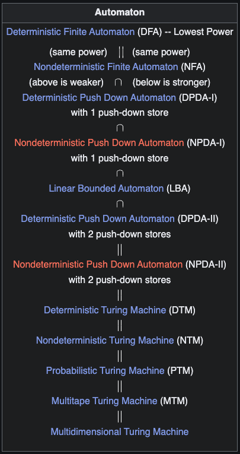

## My Models of Computation

My implementations of known theoretical [Models of Computation](https://en.wikipedia.org/wiki/Model_of_computation) in C++. (**Not** a CS project at my UNI)

### Overview

The goal of this project is to implement various modles of computations (MOCs) as closely as possible to their theorotical definitions. Primary aim with this project is to understand these simple models deeply.

Modern hardware is an abstraction over Turing Machines in a certain way. Programming languages are another abstractions over that hardware. I am using these abstractions to simulate something that is at its core.

#### Automaton models for this project:

#### TO DO

- [ ] DFA
- [ ] NFA
- [ ] PDA
- [ ] DPDA-I
- [ ] NPDA-I
- [ ] LBA
- [ ] DPDA-II
- [ ] DTM
- [ ] NTM 
- [ ] PTM
- [ ] MTM

#### Useful Resources

- [Theory of Computation](https://en.wikipedia.org/wiki/Theory_of_computation)
- [Automata Theory](https://en.wikipedia.org/wiki/Automata_theory)
- [Models of Computation](https://en.wikipedia.org/wiki/Model_of_computation)